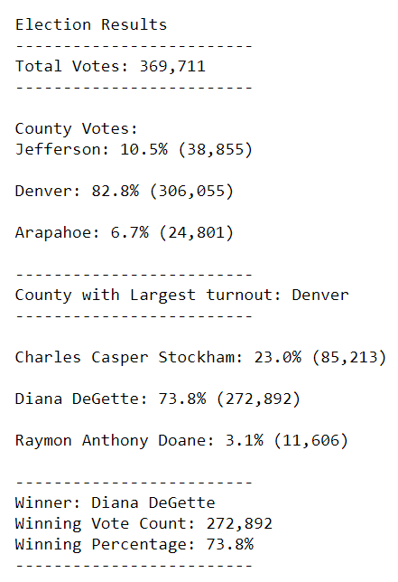

# Election_Analysis

## Resources
- Data Source: election_results.csv
- Software: Python 3.7.11, Jupyter Notebook 6.4.3

## Overview
This analysis summarized data from a Colorado local congressional election. The purpose of this analysis was to automate the sorting and counting of individual votes stored in a csv file.  Vote counts and percentages of the total were returned for each candidate and each county. The total vote count, the winning candidate, and the county with the highest number of votes were identified. 

## Results
- 369,711 votes were cast in this election.
- County votes breakdown:
  - Jefferson County had 38,000 votes; 10.5% of the total votes cast.
  - Denver County had 306,055 votes; 82.8% of the total votes cast.
  - Arapahoe County had 24,801 votes; 6.7% of the total votes cast. 
- Denver County had the largest number of votes.
- Candidate votes breakdown:
  - Charles Casper Stockham received 85,213 votes; 23.0% of the total votes cast. 
  - Diana DeGette received 272,892 votes; 73.8% of the total votes cast. 
  - Raymon Anthony Doane received 11,606 votes; 3.1% of the total votes cast. 
- Winner breakdown:
  - The winner of the election was Diana DeGette. 
  - The winner had a vote count of 272,892
  - The winner recieved 73.8% of the total votes cast. 
 
 .

## Summary Proposal
This script is a valueble investment to summarize any election. It may be used with any number of candidates and counties. The code can be modified to be used for new elections by changing the file path and name to where the new election data is stored. The indexing of columns can be modified to match file data that is in a different order. For different sizes of elecitons, the returned message may be modified to reflect different types of voting districts. One potential addition would be to break down the votes cast in each county for each candidate. To do this, we could rerun the candidate counts for each county, or use an "if" conditional statement to add to distinct counter variables. If voter demographic information is availible, we could also create counts for different demographic categories for each candidate. 

